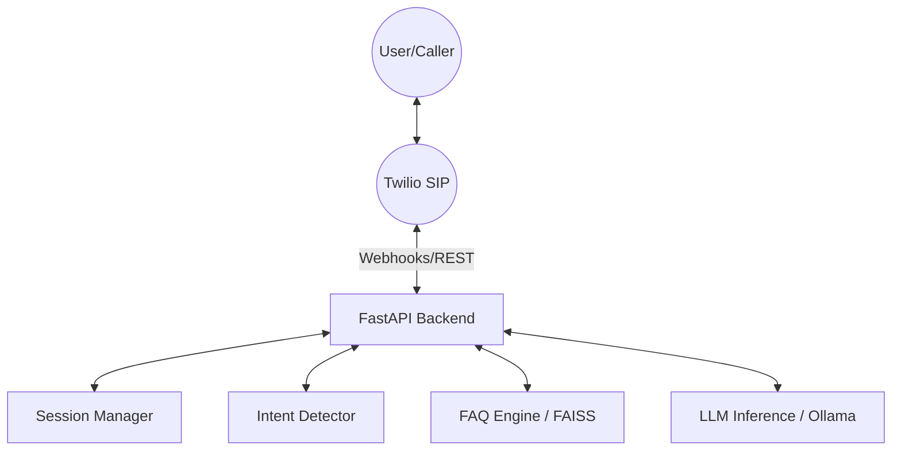

# Twilio Calling Integration Guide (Tier 1)

This document outlines the setup, architecture, and usage for the Twilio Calling integration, which enables both inbound support calls and outbound marketing calls using our AI pipeline.

---

## 🏗️ Architecture Overview



### Key Logic
1.  **Inbound**: Twilio triggers `/api/twilio/inbound-call`. We create a session and use `<Gather>` to capture speech.
2.  **Processing**: `/api/twilio/process-call` takes the SpeechResult, runs Intent Detection, checks FAQ (RAG), and falls back to LLM if needed.
3.  **Outbound**: Triggered via `/api/twilio/initiate-outbound` with custom **Business Context** and **LLM Instructions**.

---

## 🚀 Setup Instructions

### 1. Twilio Configuration
You need a Twilio Account. Get your credentials from the [Twilio Console](https://www.twilio.com/console).

**Required Variables (.env):**
- `TWILIO_ACCOUNT_SID`: Your AC... string.
- `TWILIO_AUTH_TOKEN`: Your secret token.
- `TWILIO_PHONE_NUMBER`: Your Twilio-purchased number (E.164 format).

### 2. Ngrok Tunnel
Twilio needs a public URL to send webhooks to your local machine.
```bash
ngrok http 8002
```
Copy the `https` URL and set it as `NGROK_URL` in your `.env`.

### 3. Webhook Setup
In the Twilio Console, set your phone number's **Voice & Fax** webhook:
- **A CALL COMES IN**: `HTTP POST` to `https://<YOUR_NGROK>/api/twilio/inbound-call`

---

## 🧪 Testing with Simulator

We have provided a fixed set of test numbers that trigger specific Twilio simulator behaviors (no actual credit used for these specific numbers in some regions/trial accounts).

| Number | Behavioral Trigger |
| :--- | :--- |
| `+15005550001` | **Valid Number**: Call will connect and answer. |
| `+15005550006` | **Busy**: Triggers a busy signal response. |
| `+15005550004` | **No Answer**: Triggers a timeout. |

---

## 🛠️ Developer Notes
- **TwiML Generation**: Responses are generated as raw XML with `media_type="application/xml"`.
- **RAG Integration**: Inbound calls automatically search the FAQ engine. If a match >10% confidence is found, it's used as context for the LLM.
- **Session Persistence**: Call sessions are stored in the shared `SessionManager` using `uuid4` IDs, ensuring consistency across multi-turn voice conversations.
